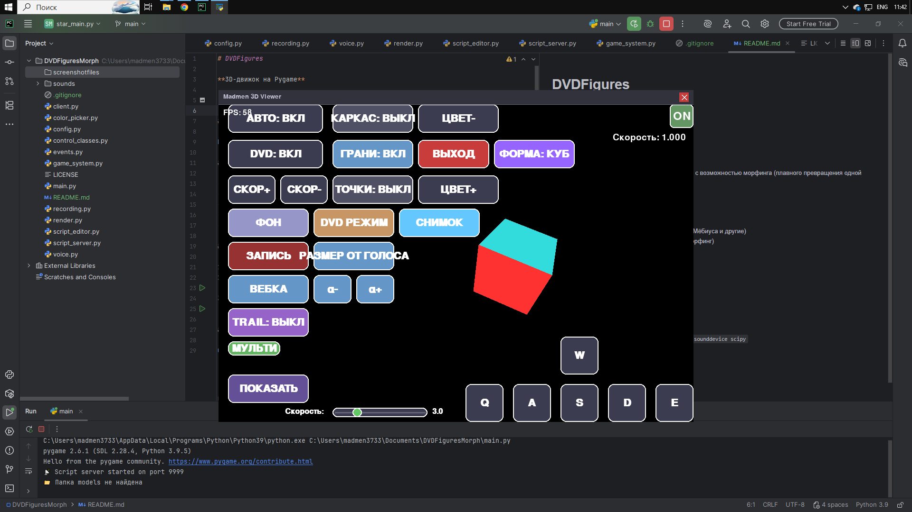

# DVDFigures

**3D-движок на Pygame**

## Что это?

Программа для просмотра и вращения 3D-фигур с возможностью морфинга (плавного превращения одной фигуры в другую).

## Возможности

- 20+ 3D-фигур (куб, сфера, конус, тор, лента Мёбиуса и другие)
- Плавное переключение между фигурами (морфинг)
- DVD-режим (летающий логотип)
- Регулировка скорости вращения и движения
- Запись видео

## Как запустить

1. Установи Python 3.8+
2. Установи зависимости:  
   `pip install pygame opencv-python numpy sounddevice scipy`
3. Запусти:  
   `python main.py`

## Лицензия

GNU GPL v3

## Скачать

Готовая сборка для Windows: **[dvdf.zip](https://github.com/madmenmadmen/dvdfigures/releases/tag/dvdfigures)**

## Другие мои проекты

**💩 [Prosto Mod](https://github.com/madmenmadmen/prostomod)** — мод для Minecraft Forge, добавляющий какашки, энергию, измерение Шрека и автоматизацию.